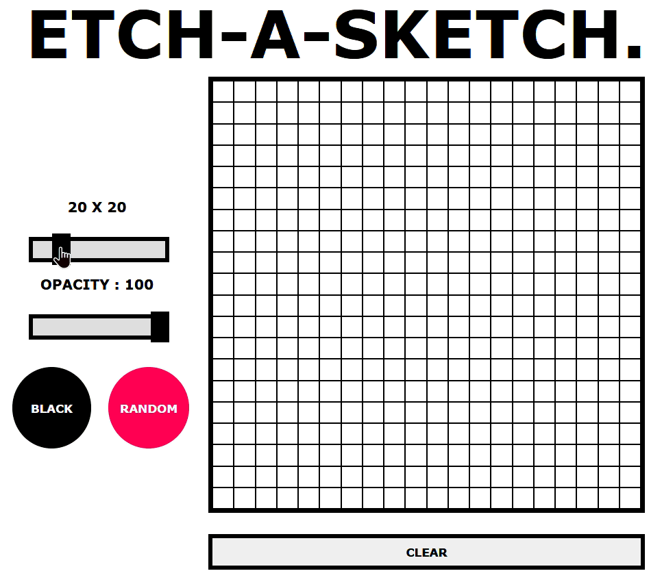

# Etch_a_Sketch
 

 This mini-project, from [The Odin Project](https://www.theodinproject.com/), combines the classic Etch-a-Sketch concept with the flexibility of a sketchpad.

## 🛠️Features :
* Draw on a customizable grid.
* Change grid size dynamically 

* Increase or decrease opacity of brush

* Use a color randomizer

* Clear the grid contents with a click

## 💡Learnings :
While building this project, I faced and overcame two major challenges: 
* _Clearing the grid elements:_
 Initially when changing grid size using the input slider , the old elements remained on the screen alone with the new elements. I realized the grids child elements needed to be clearned each time.

* _Making the grid squares fit perfectly:_
 My first grid-sizing logic which was dividing the parent elements side by the number of squares on each side worked perfectly until I reached a 19 x 19 grid. At that point floating point precision errors came into the picture which returned slightly inflated child element values . Due to this the child elements would overflow from the parent because of wrapping to the next line.
 * *Solution:* I reduced the calculated size by 0.01 to ensure they were small enough not to add an extra element , but also not large enough to wrap to the next line.
 * Since the grid used Flexbox, any small leftover space was handled automatically.
 * To maintain the square shape of the child element , used css property aspect-ratio
